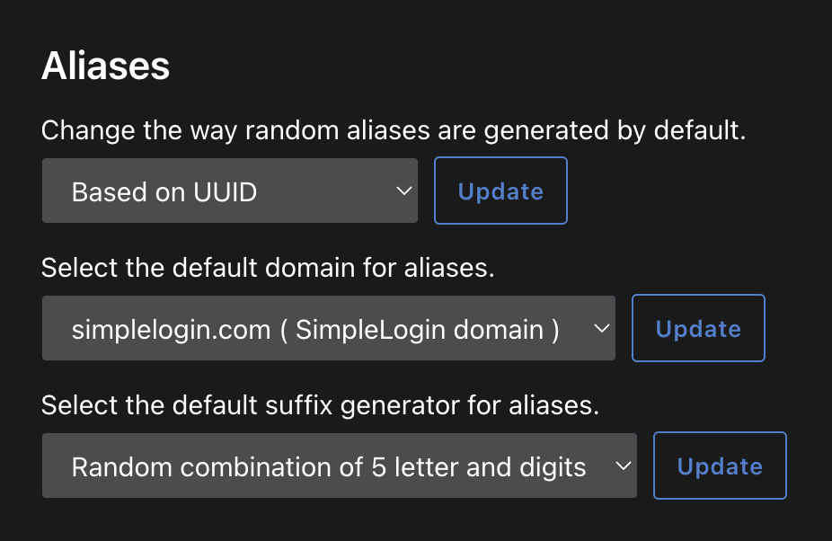

# slogin

A super lightweight, opinionated web client for [SimpleLogin](https://simplelogin.io).
Optimized for compact visibility and quick alias management.

> Note: This project is designed to run either locally or on private networks.
> DO NOT expose this publicly, since there is no built-in authentication.

## Features

- Tiny. No bulky JS frameworks. ([< 14KB](https://endtimes.dev/why-your-website-should-be-under-14kb-in-size/))
- Single-page view of all aliases, concurrently fetched with SSE streaming
- Rate-limited API proxy to stay within SimpleLogin limits
- Fuzzy search across emails and descriptions
- Sortable columns (status, alias, description, last activity, created)
- Inline note editing, pin/unpin, enable/disable, delete
- Alias creation with custom prefix, domain selection, and random generation
- Click-to-copy email addresses

## Setup

Requires [uv](https://docs.astral.sh/uv/) and Python >= 3.14.

```bash
git clone https://github.com/yuzhoumo/slogin.git
cd slogin
uv sync
```

Create a `.env` file with your
[SimpleLogin API key](https://app.simplelogin.io/dashboard/enter_sudo?next=%2Fdashboard%2Fapi_key):

```
SLOGIN_API_KEY=your_api_key_here
```

## Usage

```bash
uv run server.py
```

Open `http://localhost:5000`.

## Docker

Build and run with Docker Compose:

```bash
docker compose up -d
```

This uses a multi-stage build that bundles/minifies frontend assets with
esbuild, then runs the app with uv in a minimal Python image. To rebuild
after making changes:

```bash
docker compose up -d --build
```

## Configuration

All settings are optional environment variables (or `.env` entries):

| Variable                  | Default                      | Description         |
|---------------------------|------------------------------|---------------------|
| `SLOGIN_API_KEY`          | *(required)*                 | SimpleLogin API key |
| `SLOGIN_API_BASE`         | `https://app.simplelogin.io` | API base URL        |

The `random` option for alias creation will generate a random 8-character
alphanumeric prefix for custom domains. For non-custom domains, this option
will use the alias defaults configured in SimpleLogin:


